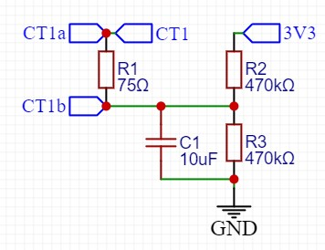
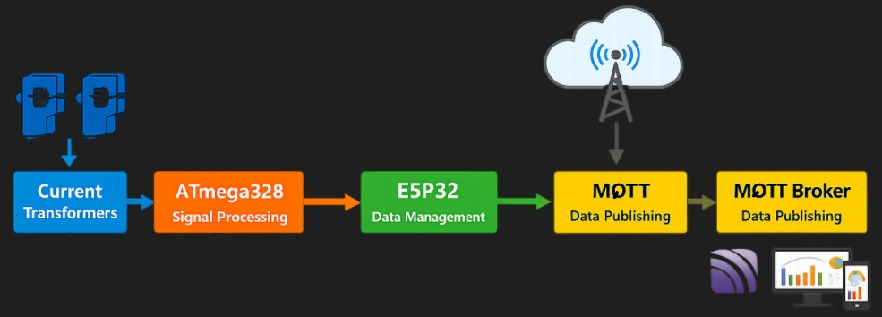
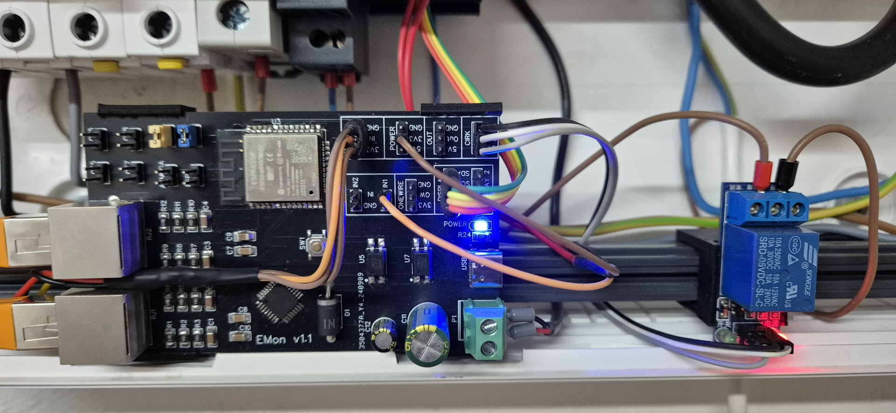
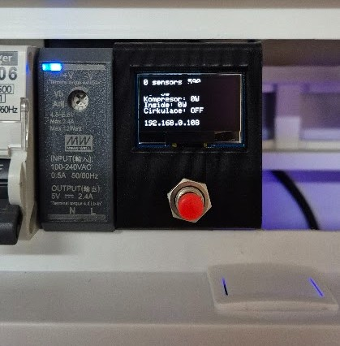
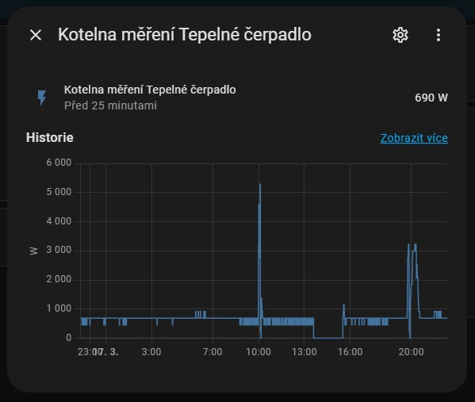

# Energy Monitor

## Purpose

Some time ago, I installed an older NIBE heat pump in my house (mainly out of curiosity). Unfortunately, it did not have any energy consumption measurement, which is why this project was created based on the EmonLib library (https://github.com/openenergymonitor/EmonLib)

## Project Goals

- Measure electrical energy parameters accurately
- Process and store measured data efficiently
- Visualize energy consumption in a clear and meaningful way
- Integration to Home Assistant via MQTT

## Basic description

- The current transformers are connected using two RJ45 connectors. Each contains 4 pairs of wires. Therefore, the maximum is 8 connected CTs. In my case, one phase is connected to the heat pump compressor, the second measures the consumption of the internal electronics and the circulation pump, and three are connected to the electric heating elements.
- The board is powered via a 230 V to 5 V converter and mounted directly in the distribution box using a 3D-printed holder. This setup proved unreliable. Nearby, there are power conductors for the wastewater pump, and EMI interference caused the ESP32 to freeze at random intervals (aprox once a week). This was resolved only after adding a grounded shielding plate between these conductors and the PCB.

## Principle of function

- Current transformer is connected to CT1a and CT1b
- The current flowing through the CT is converted into voltage using the burden resistor R1.
- The voltage divider (R2, R3) is used to set the midpoint to 1.65 V. This is necessary because we are measuring AC current. If we were measuring purely DC, we could omit the divider and connect CT1b to ground.

- The ATmega328 measures the voltage at the CT outputs at regular intervals, converts it to power, and sends it via UART to the ESP32 once per minute (the data represent the average over the past minute).
- For accurate results, it would be ideal to measure the voltage on each conductor as well. However, I found that in my case the voltage varies only minimally (±5 V). Therefore, we use the nominal value of 230 V for power calculation, which has only a negligible effect on the result.
- The ESP32 processes the data and sends it to an MQTT broker via Wi-Fi.

## Another function

- Output for an external relay is used to switch the hot water circulation on at preset times, together with presence detection.
- Input for a DHT sensor is used to measure temperature and humidity.
- Input for a float switch is used to detect emergency conditions (water leak) in the boiler room.
- Output for small display to read data without Home Assistant.
- OneWire input for temperature sensors.

